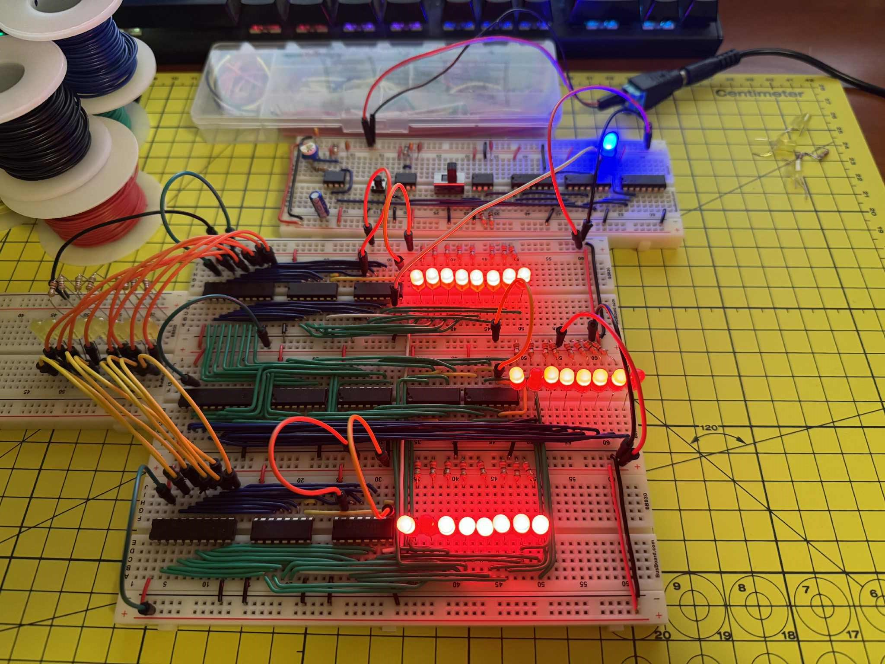
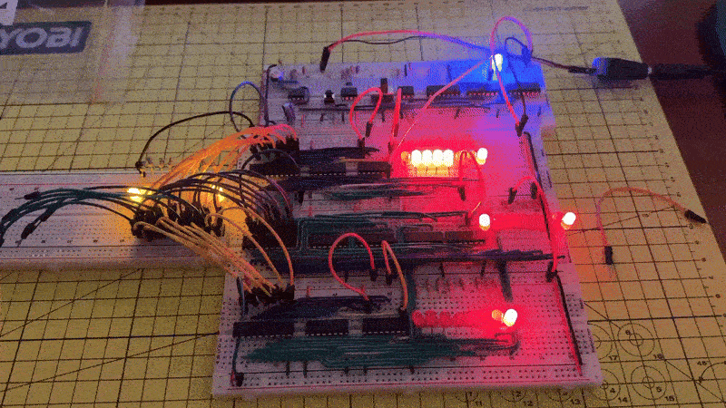

# 8-Bit-Breadboard-CPU

This project is a custom-built **8-bit CPU** assembled on breadboards using TTL logic ICs.  
It is based on Ben Eater’s educational design and schematics, which I followed as a framework while independently assembling, testing, and debugging each subsystem to deepen my understanding of computer architecture.

---

## Features Implemented
- **Clock Circuit** – stable and adjustable system clock
- **Registers** – A and B register as well as a flag register
- **Arithmetic Logic Unit (ALU)** – supports binary addition and subtraction
- **LED Output** – Represents bits

---

## Project Photos
**Clock Circuit + ALU**
  
**Registers**
  
**Testing**

---

## Key Learnings
- Practical application of digital logic (AND, OR, XOR, NOT)  
- Timing and control in sequential circuits  
- Debugging digital electronics with LEDs and a multimeter  
- Breadboard wiring and troubleshooting techniques  

---

## Next Steps
- Add program counter and instruction decoder  
- Implement RAM and a shared bus system  

---

## Tools & Components
- 74xx series TTL logic ICs  
- Breadboards and 22AWG jumper wires  
- LEDs, resistors, capacitors  
- Multimeter (for diagnostics)  
- Crimper

---

## References
- [Ben Eater’s 8-bit computer series](https://eater.net/8bit) – inspiration and schematics  
